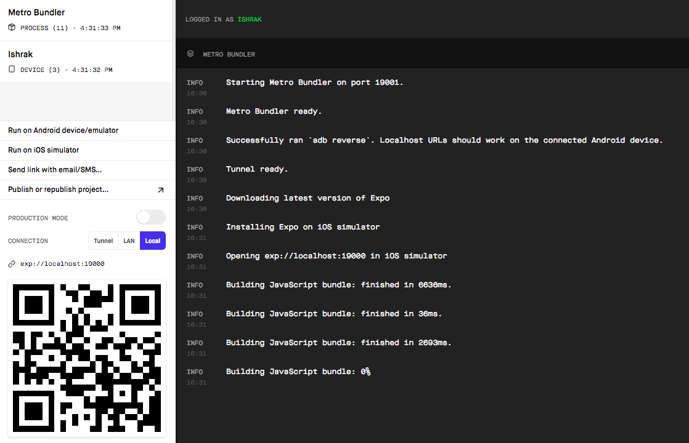

# TouroMobile

Following instructions are assuming Android and iOS related installtions are already done.

1. First install the exp and expo-cli
```
npm i -g expo-cli
```

2. Create an account in expo website and login through expo cli with credentials. Run the following command in terminal will prompt for credentials
```
expo login
```

3. Clone the repository
```
git clone git@github.com:MaxliTravelGroup/touromobile_new.git
```

4. Install necessary packages. Inside the root directory run:
```
yarn install
or
npm install
```

5. Run the following command in root directory of the project
```
expo start
```

Running the above command will open a brwoser tab like following image.



stitch to `local` tab for connection. Now specific device related instructions

- Android Emulator: Start the android emulator and when it's ready press `Run on Android device/emulator` in browser tab.

- Android Device: Install the `expo` app from google play store and scan the QR code in the browser tab through the `expo` app. The device needs to be in the same network as the development machine.

- iOS Simulator: Just press `Run on iOS simulator` in browser tab.

Other techniques are same. Like in Android `ctrl+M` will bring the dev menu and for iOS is `ctrl+D`. For Android physical device run `adb shell input keyevent KEYCODE_MENU` to bring up the dev menu.